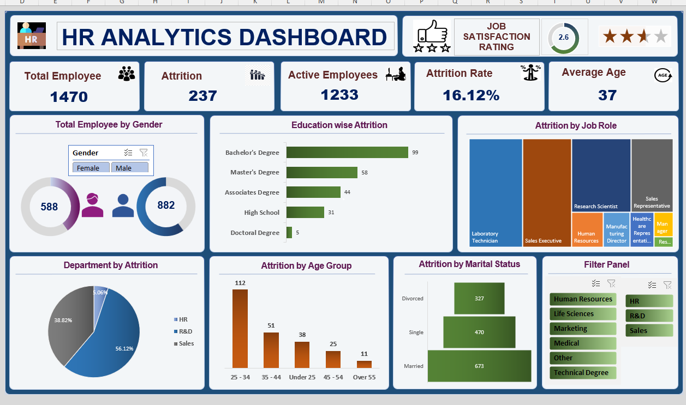

# HR Analytics Dashboard — Microsoft Excel

## 📊 Dashboard Preview

## 📌 Project Overview
An interactive HR Analytics Dashboard built in Microsoft Excel analyzing workforce data of 1,470 employees to identify attrition trends and support HR decision-making.

## 🔑 Key Insights
- **Attrition Rate:** 16.12% (237 out of 1,470 employees)
- **Highest Attrition Department:** Sales (56.12%)
- **Highest Attrition Age Group:** 25–34 years (112 employees)
- **Education:** Bachelor's Degree holders had the most attrition (99)
- **Job Satisfaction Rating:** 2.6 out of 4
- **Average Employee Age:** 37 years

## 🛠️ Tools & Features Used
- Pivot Tables & Pivot Charts
- Slicers & Filter Panel (Department-wise drill-down)
- Conditional Formatting
- Donut Charts, Bar Charts, Pie Charts
- KPI Cards (Total Employees, Active Employees, Attrition Rate)
- Interactive Gender filter

## 📁 Files
| File | Description |
|------|-------------|
| `HR_DATA_Excel.xlsx` | Main dashboard file |
| `dashboard.png` | Dashboard screenshot |

## 🎯 Skills Demonstrated
Excel · Pivot Tables · Data Visualization · Dashboard Design · HR Analytics · Data Cleaning
